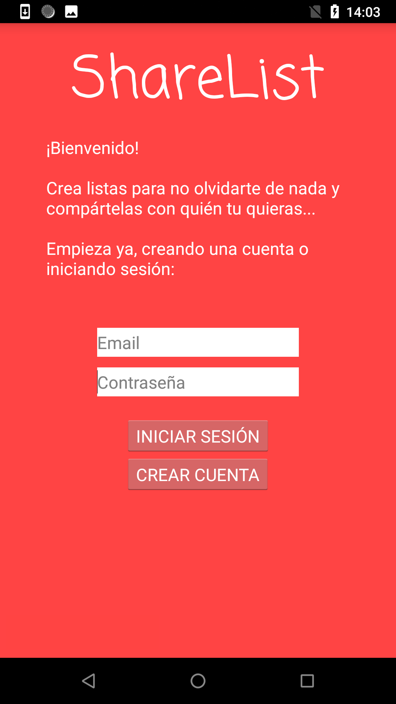
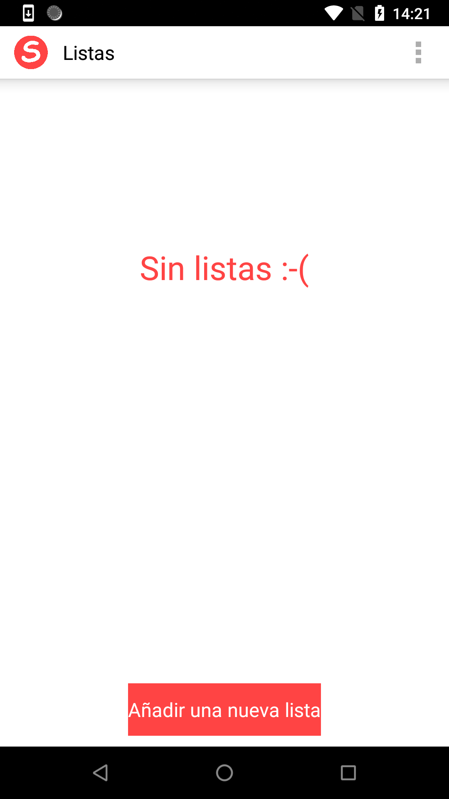
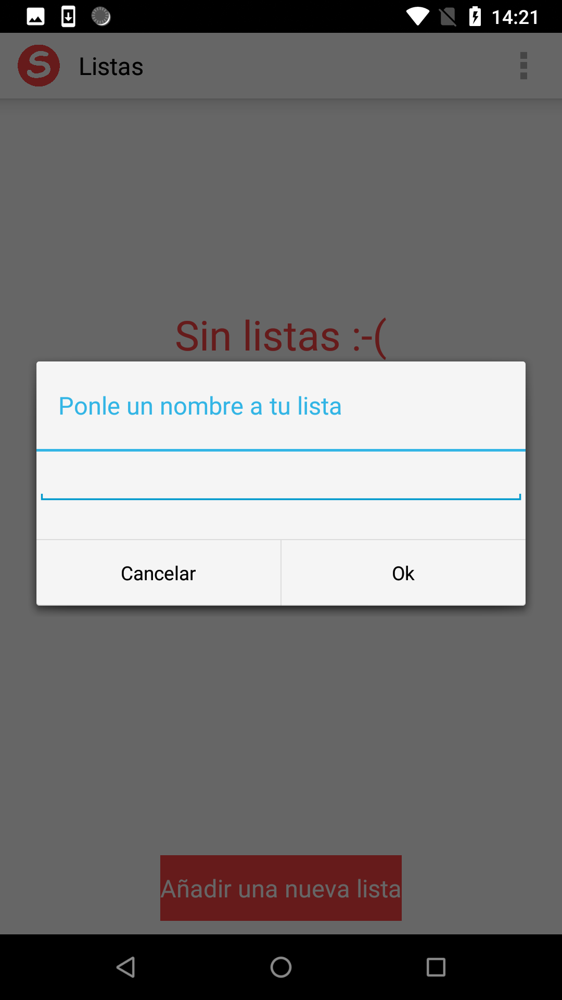
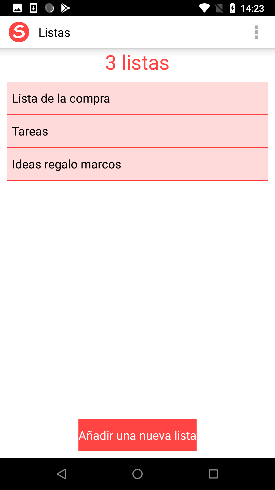
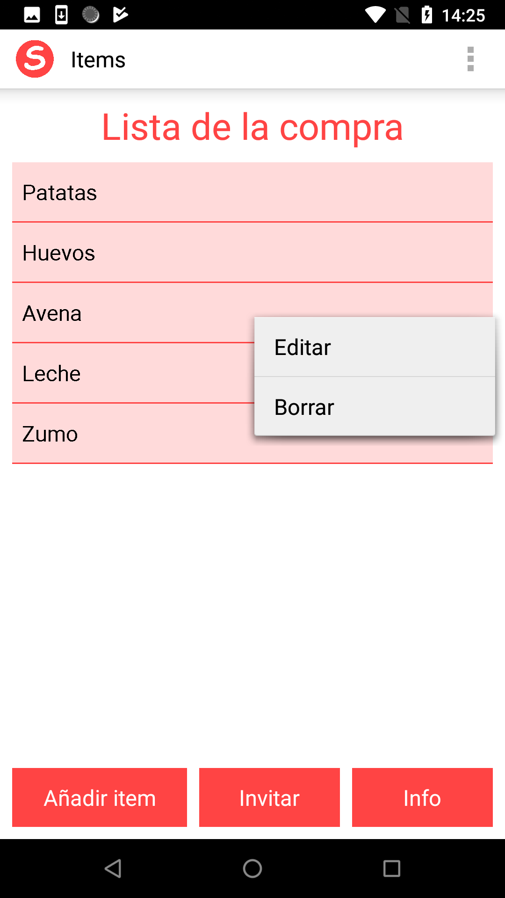
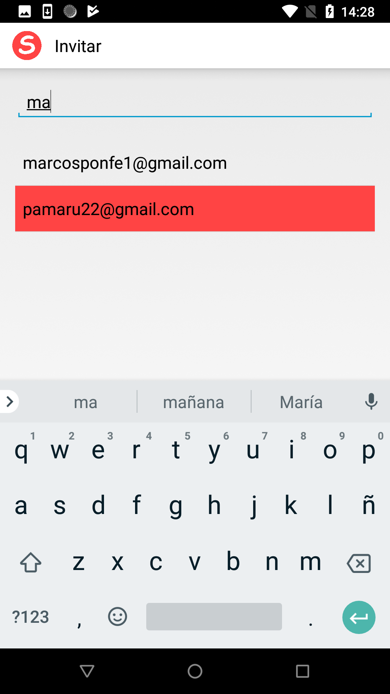

# ShareList

Proyecto tutelado de la asignatura de Programación de Sistemas.

Aplicación para la gestión de listas y con la posibilidad de utilizar estas listas en tiempo real con otros usuarios que tengan la app.

Para el backend se ha usado Firebase, para el almancenamiento de datos y la gestión de usuarios.

## Screenshots ##

